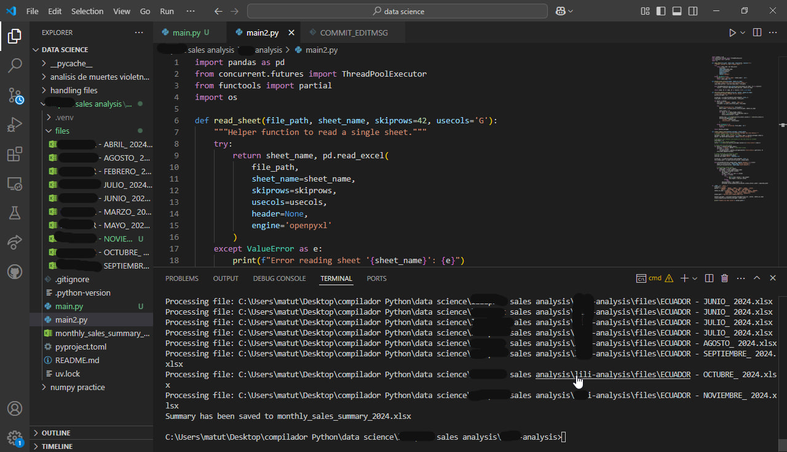
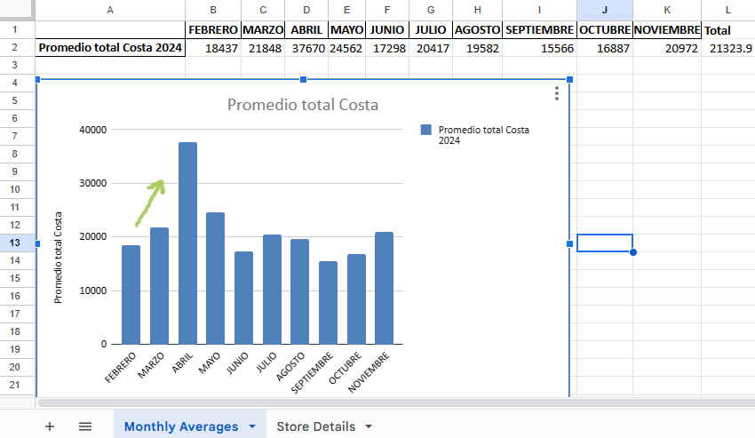
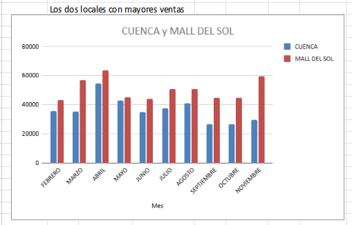
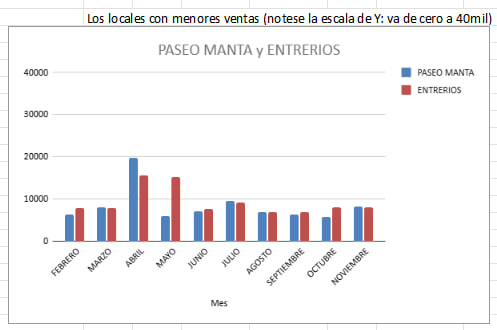
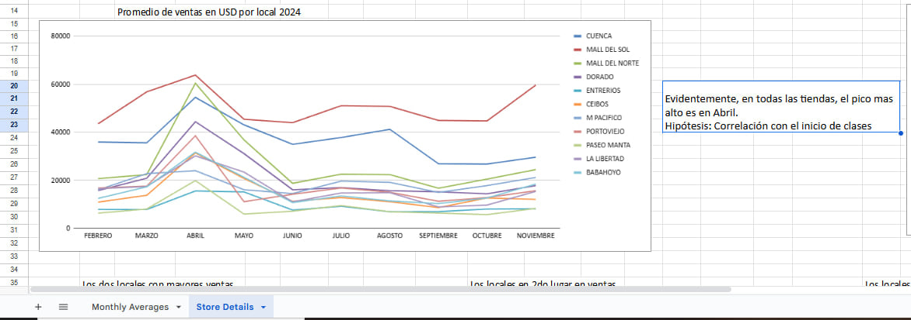
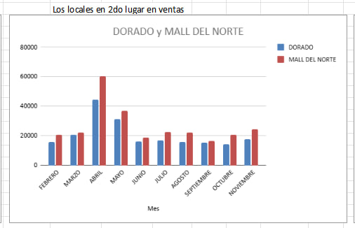
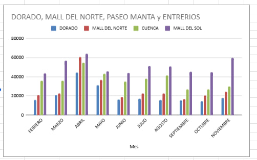

# Sales Data Analysis for a Store Chain

## 🎯 Project Overview

This project performs a **year-long sales analysis** for a store chain operating in **11 different locations** within a specific region. The analysis processes sales data spread across multiple Excel files, each containing multiple sheets, to extract key insights:

1. 📈 **Monthly Sales Average** for all stores.
2. 🏆 **Identification of the two highest** and **two lowest performing stores** per month.
3. 📉 **Visualization of sales trends** via tables and graphs.
4. 📅 **Detection of peak sales periods** to understand seasonality.
5. 📗 **Compilation of results into a new summarized Excel file**.

---

## 🛠️ Methods Used

### 1. **Data Extraction & Processing**

- 📑 **Multiple Excel files** (`.xlsx`) are loaded, with each file corresponding to a specific month.
- 📋 Each file contains sheets representing **different store locations**.
- 🔍 Sales data is extracted from each sheet, **skipping header rows and selecting the relevant column** using as parameters within `read_excel` pandas method:
  -  `openpyxl` engine
  -  `sheetname` to refer the sheet within the xlxs file
  -  `skiprows` and `use_cols` to skip rows and select the column
- 🧮 The extracted data is summed to compute total sales per store.

### 2. **Parallel Processing**

- ⚡ The script utilizes **ThreadPoolExecutor** to accelerate reading multiple sheets simultaneously.
- 🔄 The `functools.partial` function helps **parallelize Excel reading tasks**.


### 3. **Statistical Analysis**

- 📊 **Average monthly sales** across all stores are calculated.
- 📈 Each month's **highest and lowest performing stores** are identified.
- 

### 4. **Data Storage & Output**

- 📁 A **new Excel file** (`monthly_sales_summary_2024.xlsx`) is created.
- 📑 It contains **two sheets**:
  - **Monthly Averages** – A summary of sales averages.
  - **Store Details** – Monthly sales per store, organized in a tabular format.
- ✨ Auto-adjusts column widths for better readability.

---

## 📚 Modules Used

| Module | Purpose |
|--------|----------|
| `pandas` | Data manipulation and Excel reading/writing |
| `concurrent.futures.ThreadPoolExecutor` | Parallel processing for faster Excel file reading |
| `functools.partial` | Simplifies function calls in parallel execution |
| `os` | Manages file paths dynamically |

---

## 📂 File Structure

```
📂 Project Root
 ├── 📂 files/                   # Folder containing monthly Excel sales data
 ├── 📄 sales_analysis.py         # Main script for analysis
 ├── 📄 monthly_sales_summary_2024.xlsx  # Final summarized output
 ├── 📄 README.md                 # This documentation
 ├── 📄 pyproject.toml             # Project configuration for uv package manager
 ├── 📄 uv.lock                    # Lockfile for package dependencies
 ├── 📄 .python-version            # Specifies Python version used
```

---

## 📦 Dependencies

### Packages That Need to Be Installed

Using the uv package manager for faster and more reliable installation:

```bash
# Install uv if you haven't already
curl -LsSf https://astral.sh/uv/install.sh | sh

# Create a new virtual environment and install dependencies
uv venv
source .venv/bin/activate  # On Windows use: .venv\Scripts\activate
uv pip install colorama numpy openpyxl pandas tqdm xlsxwriter
```

---

## 🚀 How to Run the Analysis

### Prerequisites

Ensure you have Python installed, uv package manager set up with all dependencies:

```bash
# Check all installed dependencies using uv tree
uv tree 
```

### Running the Script

```bash
uv python main.py
```

## 🖼️ Example Screenshot of the local development environment



### Results
- A **summary Excel file** (`monthly_sales_summary_2024.xlsx`) containing:
  - ✔️ **Monthly average sales**.
  - ✔️ **Individual store sales per month**.
  - ✔️ **Peak sales recognition**.

---

## Insights & Findings

- 📈 The analysis helps the client **identify peak sales months** and **underperforming stores**.
- 📉 **Seasonal trends** can be visualized through the graphs, putting April like the higest one where all the stores have their peak.
- 🎯 **Business strategies** can be adjusted based on high and low performers.


## 🖨️ Generated Charts

### 1. **Monthly Sales Trend**


### 2. **Top and Bottom Stores Comparison**



### 3. **Sales Distribution Across Stores**


### 4. **Others**
**Best two stores**


**Best four stores**



---


##  Future Improvements

- 🤖 Automate **data collection from multiple years**.
- 📱 Implement **interactive dashboards** for real-time sales monitoring.
- 🧠 Expand the analysis with **predictive models** for future sales forecasting.

---

## ✍️ Author

DavidF

